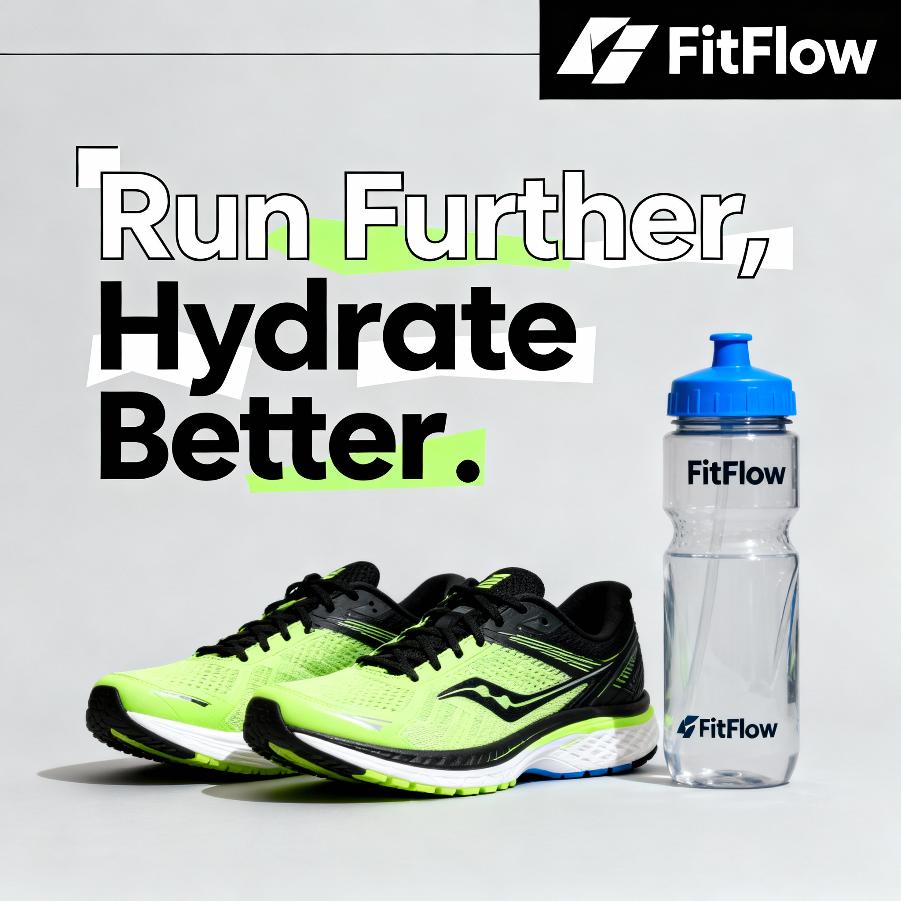
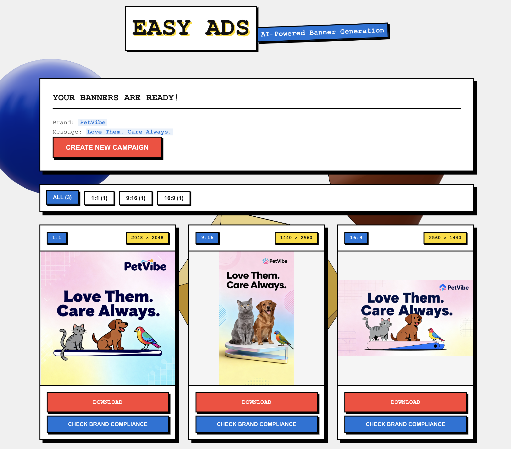

# Easy Ads - AI Creative Automation Pipeline

Generate professional advertising banners with multiple products using GenAI. A proof-of-concept creative automation pipeline powered by Replicate's Seedream-4 and GPT-4.

<p align="center">
  
  
  
</p>

<p align="center">
  
  
  
</p>

<p align="center">
  
</p>

## Why These Choices?

**Seedream-4 + GPT-4**: Seedream excels at photorealistic rendering and text-in-image generation, while GPT-4 optimizes prompts for cultural adaptation and brand consistency. This combination delivers production-quality results without requiring fine-tuning.

**Replicate API**: Eliminates infrastructure overhead - no GPU management, scaling handled automatically, pay-per-generation pricing ideal for proof-of-concepts and variable workloads.

**Text-Based Assets**: Using text files for style guides and creative briefs keeps the pipeline simple, version-controllable, and easily editable by non-technical team members without requiring specialized tools.

## Features

- **Multi-Product Generation**: Feature 2+ products in a single banner
- **AI-Powered**: Bytedance Seedream-4 via Replicate + GPT-4 prompt optimization
- **High Resolution**: 2048x2048 output
- **Multi-Format**: Support for 1:1, 9:16, and 16:9 aspect ratios
- **Brand Intelligence**: Auto-generates brand names and campaign messages
- **Legal Compliance**: Automated prohibited words detection in campaign content (50+ rules)
- **Sensitive Content Filtering**: Built-in content moderation with error handling and form validation
- **Brand Compliance Checker**: AI-powered verification that generated images contain brand logo and name
- **Web Interface**: Modern React frontend with real-time progress tracking
- **REST API**: FastAPI backend for programmatic access
- **CLI Tool**: Command-line interface for batch operations
- **Docker Ready**: Full containerization with Docker Compose

---

## Quick Start

### Using Docker (Recommended)

The easiest way to run the entire application:

#### Prerequisites
- Docker 20.10+
- Docker Compose 2.0+
- Replicate API token ([Get one here](https://replicate.com))

#### 1. Clone and Configure
```bash
git clone <your-repo-url>
cd easy-ads
cp .env.example .env
# Edit .env and add your REPLICATE_API_TOKEN
```

#### 2. Build and Run
```bash
docker compose up --build
```

This will:
- Build both frontend and backend containers
- Start the backend API on `http://localhost:8000`
- Start the frontend on `http://localhost:80`
- Set up networking between services
- Mount volumes for persistent outputs

#### 3. Access the Application
- **Web App**: http://localhost
- **API Docs**: http://localhost:8000/docs

#### Docker Commands
```bash
# Start in detached mode
docker compose up -d

# View logs
docker compose logs -f

# Stop services
docker compose down

# Rebuild after changes
docker compose up --build

# Clean everything
docker compose down -v
```

---

### Using Makefile (Local Development)

For local development without Docker:

#### 1. Initial Setup
```bash
make setup
```
This checks your environment and installs all dependencies.

#### 2. Run the Application
```bash
make run
```
This starts both backend and frontend servers. Visit `http://localhost:5173`

#### Other Commands
```bash
make help          # Show all available commands
make backend       # Run backend only
make frontend      # Run frontend only
make cli           # Run the CLI tool
make status        # Check server status
make stop          # Stop all servers
make clean         # Clean build artifacts
```

---

### Manual Setup (Alternative)

#### Prerequisites
- Python 3.9+
- Node.js 18+
- pip or uv package manager

#### 1. Install Dependencies

**Using uv (recommended):**
```bash
uv sync
```

**Using pip:**
```bash
pip install -e .
```

**Frontend:**
```bash
cd frontend
npm install
```

#### 2. Configure API Token

Create a `.env` file in the project root:

```bash
cp .env.example .env
```

Edit `.env`:
```env
REPLICATE_API_TOKEN=your_token_here
```

#### 3. Run Services

**Terminal 1 - Backend:**
```bash
cd backend
python main.py
# Or: uvicorn backend.main:app --reload
```

**Terminal 2 - Frontend:**
```bash
cd frontend
npm run dev
```

**Access the app:** http://localhost:5173

---

## Usage

### Web Interface

1. Open http://localhost (Docker) or http://localhost:5173 (local)
2. Fill in the form:
   - **Products**: Enter at least 2 products (e.g., "MTB tire", "bikepacking bags")
   - **Target Market**: Select region (e.g., US, UK, Germany, Japan)
   - **Target Audience**: Describe audience (e.g., "ages 25-55, outdoor enthusiasts")
   - **Brand Name**: Optional (auto-generated if blank)
   - **Campaign Message**: Optional (auto-generated and translated if blank)
3. Click "Generate Campaign"
4. Monitor real-time progress
5. View and download generated banners

### CLI Tool

Run a single campaign from the command line:

```bash
python main.py
```

This generates banners in all three aspect ratios (1:1, 9:16, 16:9) based on `examples/campaign.json`. Outputs are organized in subdirectories by aspect ratio.

#### Configuration File

Edit `examples/campaign.json`:

```json
{
  "products": [
    "MTB tire",
    "bikepacking bags"
  ],
  "target_market": "UK",
  "target_audience": "ages 25-55, outdoor enthusiasts",
  "campaign_message": "",
  "brand_name": ""
}
```

**Required Fields:**
- `products` (array, min 2): Products to feature
- `target_market` (string): Target region
- `target_audience` (string): Audience description

**Optional Fields:**
- `brand_name` (string): Brand name (auto-generated if blank)
- `campaign_message` (string): Campaign slogan (auto-generated and translated if blank)

### REST API

The backend provides a REST API for programmatic access:

#### POST /api/generate
Start a new campaign generation job.

**Request:**
```json
{
  "products": ["product1", "product2"],
  "target_market": "US",
  "target_audience": "ages 25-55",
  "brand_name": "Optional",
  "campaign_message": "Optional"
}
```

**Response:**
```json
{
  "job_id": "uuid",
  "status": "pending",
  "message": "Generation started"
}
```

#### GET /api/status/{job_id}
Check job status and progress.

**Response:**
```json
{
  "job_id": "uuid",
  "status": "processing",
  "progress": {
    "step": "Generating 1:1 banner",
    "progress": 60
  }
}
```

#### GET /api/images/{job_id}
Get generated images for a completed job.

**Response:**
```json
{
  "brand_name": "BrandName",
  "campaign_message": "Campaign Message",
  "translated_campaign_message": "Translated Message",
  "images": [
    {
      "aspect_ratio": "1:1",
      "url": "/outputs/path/to/image.png",
      "size": [2048, 2048]
    }
  ]
}
```

#### POST /api/check-compliance
Check brand compliance of generated images.

**Interactive API Docs:** http://localhost:8000/docs

---

## Configuration

### Supported Markets

US, UK, Germany, France, Spain, Japan, China, Italy, Brazil, Canada, Australia, Netherlands, Poland, Russia, Mexico, and more.

### Aspect Ratios

- `1:1` - Square (Instagram posts)
- `9:16` - Vertical (Stories, Reels)
- `16:9` - Horizontal (YouTube, web banners)

### Assets

Place brand assets in the `assets/` directory:
- **Text files**: Brand guidelines, style guides, tone of voice
- **Images**: Reference images, logos, product photos

The pipeline automatically loads and uses these assets for prompt enrichment.

---

## Project Structure

```
easy-ads/
├── backend/
│   └── main.py                 # FastAPI backend
├── frontend/
│   ├── src/
│   │   ├── App.jsx            # Main React app
│   │   └── components/        # React components
│   ├── package.json           # Frontend dependencies
│   └── vite.config.js         # Vite configuration
├── pipeline/
│   ├── generator.py           # Image generation logic
│   ├── assets_loader.py       # Asset loading utilities
│   ├── campaign_utils.py      # Campaign utilities
│   └── compliance.py          # Brand compliance checker
├── examples/
│   └── campaign.json          # Example campaign configuration
├── assets/                    # Brand assets and style guides
├── outputs/                   # Generated banners (auto-created)
├── main.py                    # CLI entry point
├── pyproject.toml             # Python dependencies
├── docker-compose.yml         # Docker orchestration
├── Dockerfile.backend         # Backend container
├── Dockerfile.frontend        # Frontend container
├── nginx.conf                 # Nginx configuration
├── .env.example               # Environment template
└── README.md                  # This file
```

---

## Requirements

### Docker Deployment
- Docker 20.10+
- Docker Compose 2.0+
- Replicate API token

### Local Development
- Python 3.9+
- Node.js 18+
- Replicate API token

**Python dependencies** are defined in [pyproject.toml](pyproject.toml)

**Frontend dependencies** are defined in [frontend/package.json](frontend/package.json)

---

## Architecture

### High-Level Overview

```
┌─────────────────────────────────────────────────────────┐
│                    Easy Ads Pipeline                     │
├──────────────┬──────────────────┬───────────────────────┤
│   Frontend   │     Backend      │     AI Services       │
│   (React)    │    (FastAPI)     │   (Replicate/GPT-4)   │
└──────────────┴──────────────────┴───────────────────────┘
```

### Components

1. **Frontend (React + Vite)**
   - Modern SPA with real-time progress tracking
   - Form validation and user feedback
   - Image gallery and download functionality

2. **Backend (FastAPI)**
   - REST API for campaign generation
   - Background job processing
   - Asset management
   - Brand compliance checking

3. **Pipeline (Python)**
   - Legal compliance validation (prohibited words)
   - Campaign prompt optimization (GPT-4)
   - Image generation (Seedream-4 via Replicate)
   - Brand compliance verification (AI vision)
   - Asset loading and enrichment
   - Multi-format output

4. **Docker Infrastructure**
   - Backend: Python 3.9-slim container
   - Frontend: Nginx Alpine (multi-stage build)
   - Persistent volumes for outputs
   - Health checks and auto-restart

---

## License

This is a proof-of-concept project for educational purposes.

